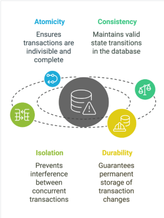

# DATABASE ACID PROPERTIES AND NORMALIZATION

## ACID Transactions

ACID transactions refer to four properties that ensures the reliable processing of database transactions. The four principles are:

- Atomicity
- Consistency
- Isolation
- Durability

These principles guarantee that transactions are executed fully, without partial updates or data corruption, even in the case of system failure. ACID transactions are critical in scenarios where data integrity is paramount.

Examples:

In banking transactions, `ACID` guarantees that moey is either fully transfered or not at all preventing issues like partial transfers or double deductions. In e-commerce, ACID principles ensure customer orders are processed correctly, payments are completed and inventory updates reflect real-time stock levels.

### Breaking Down the ACID Properties

Each of the four properties that comprise of the ACID principles addresses a specific transaction management aspect.

**1. Atomicity**
Atomicity guarantees that a transaction is treated as a **single, invisible unit**. This means that all operations within a transaction must either be completed fully od not at all. If any part of the transaction fails, the system rolls back the entire transaction, ensuring no partial updates occur.

**2. Consistency**
Consistency ensures tat a transaction brings the database from one **valid state** to another while adhering to predefined constraints. After completing a transaction, the data must meet all the database's integrity rules.

**3. Isolation**
Isolation prevents transactions from **interfering with each other**. When multiple transactions are executed simultaneously, isolation ensures they don't affect each other’s outcomes. Each transaction must be isolated to avoid conflicts – especially in high-concurrency environments.

**4. Durability**
Durability guarantees that once a transacction is completed, its changes are **permanently stored** in the database (even if the system crashes immediately afterward). This ensures that the data remains intact and accessible after failures.



#### Example SQL transaction with ACID compliance

This example demonstrates transferring money between two accounts to ensure that the transaction either fully completes or fully rolls back in case of failure in PostgreSQL:

```sql
BEGIN;

-- Step 1: Debit $500 from Account A
UPDATE accounts
SET balance = balance - 500
WHERE account_id = 'A';

-- Step 2: Credit $500 to Account B
UPDATE accounts
SET balance = balance + 500
WHERE account_id = 'B';

-- Commit the transaction if both steps succeed
COMMIT;

-- Rollback the transaction if an error occurs
ROLLBACK;
```

In this transaction:

- If either update fails, the transaction will be rolled back.
- The database remains valid, as the total balance across both accounts is unchanged.
- If another transaction attempts to modify these accounts concurrently, locking guarantees that one completes before the other.
- Once the transaction is commited, the change are saved permanently, even if the system crashes afterwards.

## Normalization in SQL

Normalization is the process of organizing data within a database (**relational database**) to eliminate data anomalies, such as redundancy.

In simpler terms, it involves breaking down a large, complex table into smaller and simpler tables while maintaining data relationships. It is normally used when dealing with a large datasets.

### Importance of Normalization

Normalization plays a crutial role in database design:

1. **Reduces redundancy**: Redundancy s when the same information is stored multiple times, and a good way of avoiding this is by splitting data into smaller tables.
2. **Impoves query perfomance**: You can perform faster query execution on smaller tables that have undergone normalization.
3. **Minimizes update anomalies**: With normalized tables, you can easily update data without affecting other records.
4. **Enhances data integrity**: It ensures that data remains consistent and accurate.

### Causes for the need of Normalization

There are several factors that drive the need for normalization, from data redundancy to difficulty managing relationships.

- **Insertion, deletion, and update anomalies**: Any form of change in a table can lead to errors or inconsistencies in other tables if not handled carefully. These changes can either be adding new data to a database, updating the data, or deleting records, which can lead to unintended loss of data.
- **Difficulty in managing relationships**: It becomes more challenging to maintain complex relationships in an unnormalized structure.

## Different Types of Database Normalization

### First Normal Form (1NF)

This normalization level ensures that each column in your data contains only atomic values. Atomic values in this context means that each entry in a column is indivisible. It is like saying that each cell in a spreadsheet should hold just one piece of information. 1NF ensures atomicity of data, with each column cell containing only a single value and each column having unique names.

**Example**:

| title                                 | author           | genre   | borrowed_by                     |
| ------------------------------------- | ---------------- | ------- | ------------------------------- |
| To Kill a Mockingbird                 | Harper Lee       | Fiction | John Doe, Jane Doe, James Brown |
| The Lord of the Rings                 | J. R. R. Tolkien | Fantasy | Emily Garcia, David Lee         |
| Harry Potter and the Sorcerer’s Stone | J.K. Rowling     | Fantasy | Michael Chen                    |

#### The Solution

In 1NF, we create a separate table for borrowers and link them to the book table. These tables can either be linked using the foreign key in the borrower table or a separate linking table. The foreign key in the borrowers table approach involves adding a foreign key column to the borrowers table that references the primary key of the books table. This will enforce a relationship between the tables, ensuring data consistency.
**Books table**

| book_id | title                                 | author           | genre   |
| ------- | ------------------------------------- | ---------------- | ------- |
| 1       | To Kill a Mockingbird                 | Harper Lee       | Fiction |
| 2       | The Lord of the Rings                 | J. R. R. Tolkien | Fantasy |
| 3       | Harry Potter and the Sorcerer’s Stone | J.K. Rowling     | Fantasy |

**Borrowers table**

| borrower_id | name         | book_id (FK) |
| ----------- | ------------ | ------------ |
| 1           | John Doe     | 1            |
| 2           | Jane Doe     | 1            |
| 3           | James Brown  | 1            |
| 4           | Emily Garcia | 2            |
| 5           | David Lee    | 2            |
| 6           | Michael Chen | 3            |

### Second Normal Form (2NF)

Eliminates partial dependencies by ensuring that non-key attributes depend only on the primary key. What this means, in essence, is that there should be a direct relationship between each column and the primary key, and not between other columns.

**Example**:

From the 1NF that was implemented, we already have two separate tables (you can check the 1NF section).

Now, let’s say we want to link these tables to record borrowings. The initial approach might be to simply add a borrower_id column to the books table, as shown below:

| book_id | title                                 | author           | genre   | borrower_id |
| ------- | ------------------------------------- | ---------------- | ------- | ----------- |
| 1       | To Kill a Mockingbird                 | Harper Lee       | Fiction | 1           |
| 2       | The Lord of the Rings                 | J. R. R. Tolkien | Fantasy | NULL        |
| 3       | Harry Potter and the Sorcerer’s Stone | J.K. Rowling     | Fantasy | 6           |

This might look like a solution, but it violates 2NF simply because the borrower_id only partially depends on the book_id. A book can have multiple borrowers, but a single borrower_id can only be linked to one book in this structure. This creates a partial dependency.

#### The Solution

**Book_borrowings table**

| borrowing_id (PK) | book_id (FK) | borrower_id (FK) | borrowed_date |
| ----------------- | ------------ | ---------------- | ------------- |
| 1                 | 1            | 1                | 2024-05-04    |
| 2                 | 2            | 4                | 2024-05-04    |
| 3                 | 3            | 6                | 2024-05-04    |

This table establishes a clear relationship between books and borrowers. The book_id and borrower_id act as foreign keys, referencing the primary keys in their respective tables. This approach ensures that borrower_id depends on the entire primary key (book_id) of the books table, complying with 2NF.

### Third Normal Form (3NF)

3NF builds on 2NF by eliminating transitive dependencies. A transitive dependency occurs when a non-key attribute depends on another non-key attribute, which in turn depends on the primary key. It basically takes its meaning from the transitive law.

**Example**:

| borrowing_id (PK) | book_id (FK) | borrower_id (FK) | borrowed_date | due_date   |
| ----------------- | ------------ | ---------------- | ------------- | ---------- |
| 1                 | 1            | 1                | 2024-05-04    | 2024-05-20 |
| 2                 | 2            | 4                | 2024-05-04    | 2024-05-18 |
| 3                 | 3            | 6                | 2024-05-04    | 2024-05-10 |

By placing the due_date column in the book_borrowing table, we have successfully eliminated the transitive dependency.
